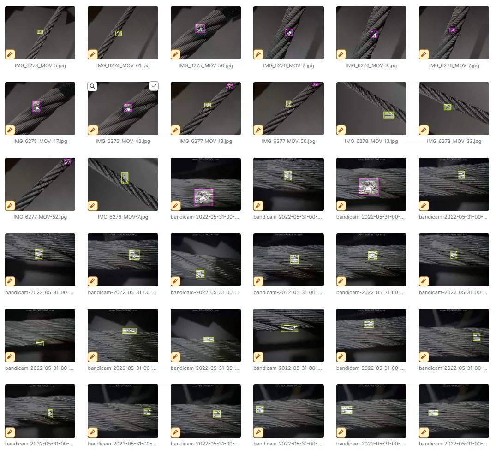
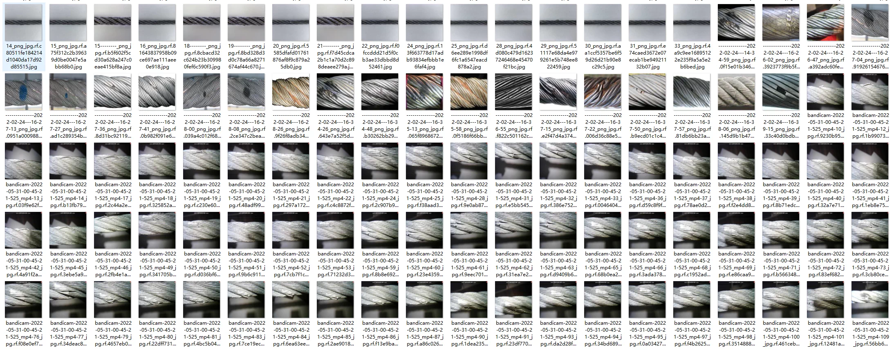
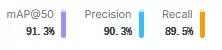
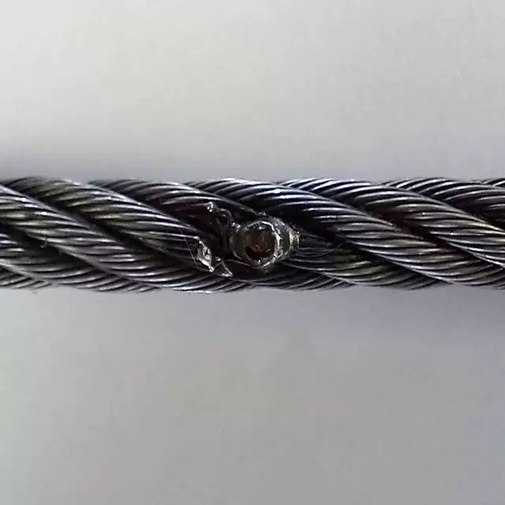
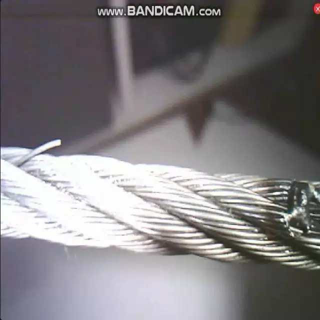
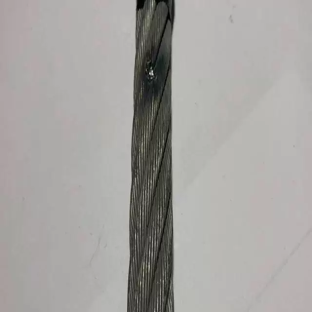

## Body

Science Dataset: Strainer/Cable Damage Detection YOLO format

Total 1318 images, labeled and divided into train (919), val (265), test (134)

Divided into 2 categories, break and thunderbolt.

## Images

Here is a pay link on Stripe ( https://buy.stripe.com/3cs8yP7sY87d0vu9AB ). Please contact me lonlonago@foxmail.com after funding $89, and I will send you a complete data files , thank you!

